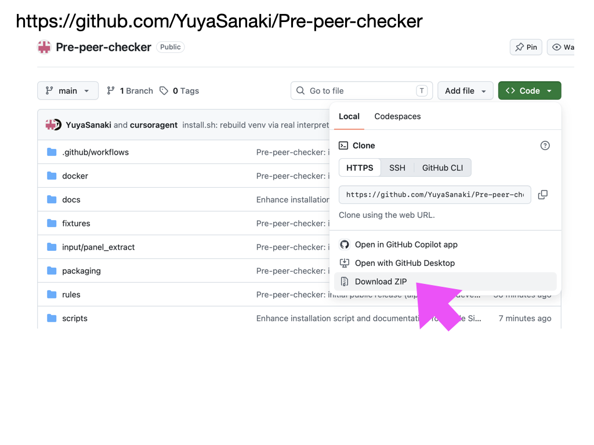
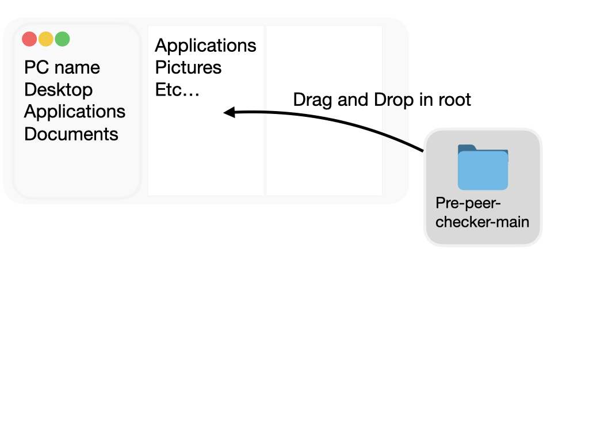
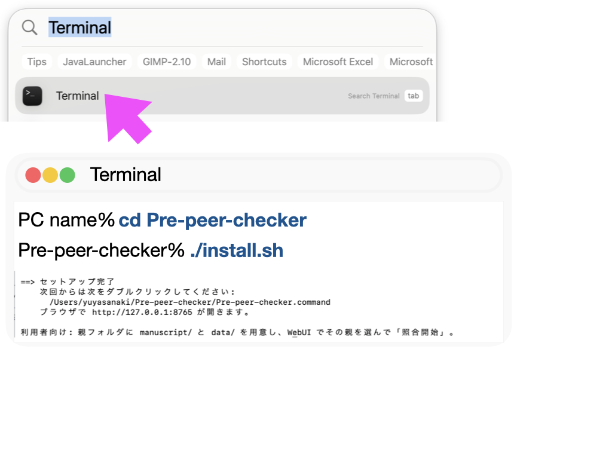
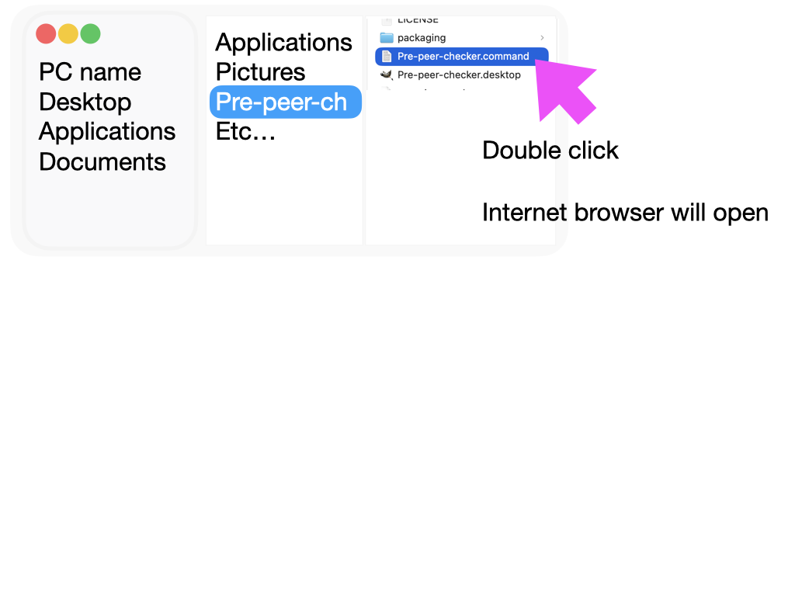
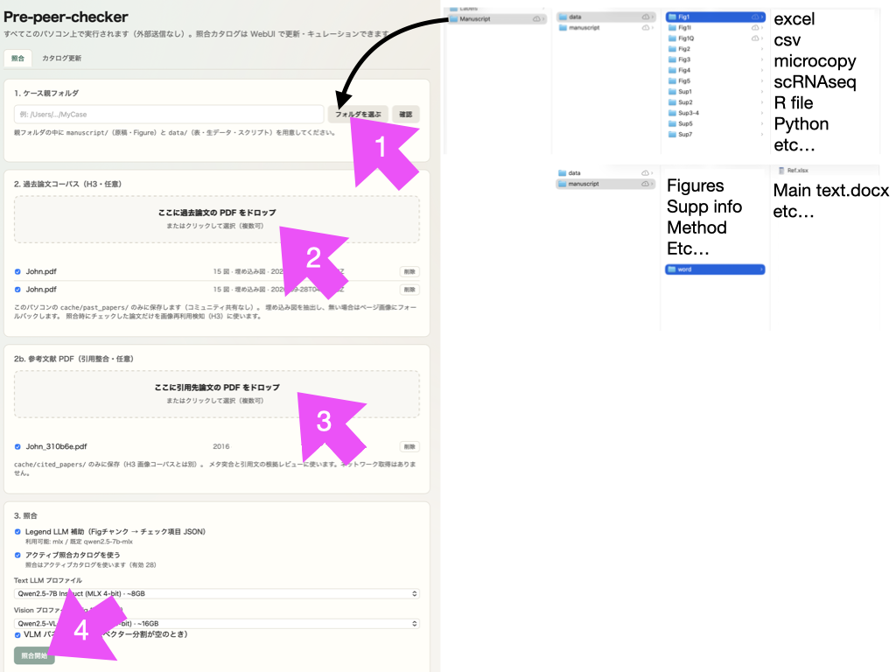
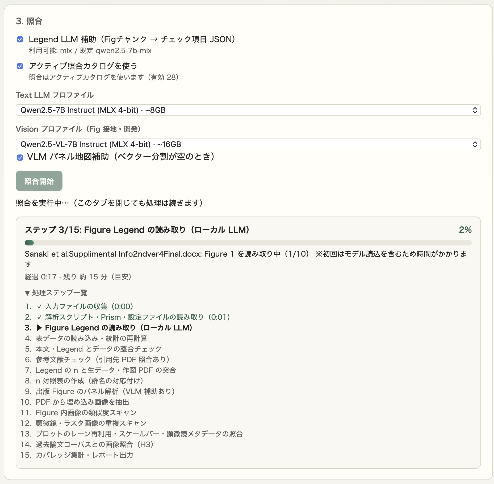
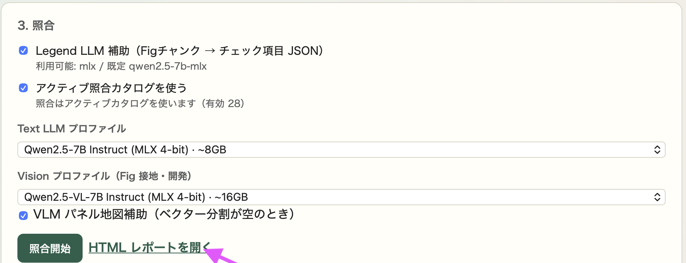

# Pre-peer-checker

[日本語](README.md) | **English**

> [!WARNING]
> **This is alpha software under active development.** Specifications and output formats may change without notice. Detection accuracy is still being validated, and the absence of Warnings does **not** mean "no problems". Use the results as an aid for pre-submission self-checks; a human must always make the final judgment.

> [!NOTE]
> The Japanese [README.md](README.md) is the authoritative version. If the two differ, the Japanese version prevails. Documents under `docs/` and the WebUI are currently in Japanese only.

## Feedback

We are collecting **misses and false positives** from real manuscripts and data to improve accuracy. We would greatly appreciate any feedback (misses, types of manuscripts or data that do not work well, checks you would like added, etc.) via Slack, email, [GitHub Issues](https://github.com/YuyaSanaki/Pre-peer-checker/issues), and so on.

The following information is helpful:

- Environment (Mac / Linux, GPU or not) and whether LLM / VLM assistance was on or off
- False positives: the Warning tag, `pattern_id`, and what was actually correct
- Misses: the type of inconsistency that should have been caught (e.g., n in the Legend does not match the number of raw-data rows)
- Errors: the error message shown on screen or in the terminal

**Do not send unpublished manuscripts, raw data, images, or personal information as-is.** If you share anything, make a minimal reproduction with values and names masked (synthetic data). Examples of synthetic data are in [`fixtures/synthetic/`](fixtures/synthetic/).

## What it checks

Pre-peer-checker automatically checks for **inconsistencies between your manuscript, figures, experimental data, and analysis code** before you submit a paper. It helps you catch accidental mistakes, such as mistyped n values, mixed-up data, or wrongly pasted figures, before submission.

- **Everything runs on your own computer.** Your manuscript and data are never sent anywhere, and there are no external API fees.
- **You operate it in a web browser.** Just choose a folder and click "Start verification".
- **Results come as a list of "places worth checking"** (Warnings).

Deciding whether something is inconsistent is not left to AI. AI (LLM / VLM) is used to read information and context, such as n values, group names, and statistics, from the manuscript and figures; what it reads is then compared mechanically against the experimental data and analysis code. Image similarity is computed with image-recognition models, but whether it becomes a Warning is decided by fixed thresholds. The viewpoints checked are compiled into a catalog of cases frequently flagged on Retraction Watch and PubPeer.

| Area | Examples |
| --- | --- |
| Sample size (n) | n in a Figure Legend does not match the number of raw-data rows / the data has more rows than the stated n, but no exclusion criteria are given / count-based n (e.g., colonies) does not match |
| Data mix-ups | The same data is used for different conditions or figures / a file name does not match its content / group names (genotypes, conditions) differ between the text, figures, and analysis settings |
| Statistics | Mean, SD, or p values recomputed from raw data do not match the text / three or more groups without multiple-comparison correction / paired vs. unpaired test does not match the data structure |
| Error bars | The Legend says SEM, but the values computed from raw data are SD (or vice versa) |
| Transcribed numbers | Means or p values in the text do not match those in tables or figures |
| Image duplication / reuse | The same image appears in different panels of the paper, or in your own past papers (missing source attribution) / rotated, cropped, or rescaled images, or blot lanes, are reused |
| Magnification / scale | The same image is labeled with different magnifications or scale bars in different panels |
| Shared controls | The same control is used in several panels without being stated / a subset of a shared control (with some points removed) is presented as an independent experiment |
| Source data values | Values that should come from independent samples are exactly identical / values from different conditions are exact integer multiples / survival rate × number of animals is not an integer |
| Consistency with Methods | Ratios or conditions stated in the Methods do not match the values in the figures |
| Notation / references | "Fig. 1C" in the text does not match the actual panel / missing or duplicate references / a citing sentence contradicts the cited paper |
| Number formatting | Values derived from ratios or normalization keep excessive digits (e.g., 1/3 → 0.3333) |

The table above lists the main viewpoints only. The full list (detection criteria per `pattern_id`) is in the [detection catalog](docs/DETECTION_AND_MODELS.md) (Japanese).

## Intended use and requests to users

This software is a **self-check aid for authors (including co-authors and their labs) to review their own manuscripts before submission**.

- **Do not use it for any other purpose.** It is not intended for examining or investigating other people's papers or already published papers.
- **The output of this software is not a basis for judging research misconduct.** Warnings are a mechanical list of "places a human should probably look at", and include both false positives and misses. Image similarity or data mismatches often have legitimate explanations, such as reuse of the same control, inconsistent wording, or reading errors by the tool itself. The presence or absence of Warnings alone cannot determine whether research is correct or what a researcher intended.
- **Do not use the output for posting on PubPeer or similar sites, for accusations or reports of research misconduct, or as material to criticize specific researchers.** If mechanical results circulate out of context, poorly founded suspicions may unfairly damage researchers' reputations and trust in their research.
- If you have research-integrity concerns, do not rely on this software's output. Have a human check the primary data and original materials, and follow the official procedures of the relevant institution or journal.

Please also read the [Disclaimer](#disclaimer).

## Requirements

| OS / hardware | Status | Notes |
| --- | --- | --- |
| **macOS (Apple Silicon: M1 or later)** | ✅ Recommended, all features | macOS 14 or later recommended |
| **Linux (x86_64 / aarch64) + NVIDIA GPU** | ✅ All features | NVIDIA driver 560 or later. Verified on DGX Spark (aarch64 / GB10) and x86_64 + H100 |
| Linux + AMD GPU (ROCm) / Intel GPU (XPU) | ⚠️ Experimental | x86_64 only. Falls back to CPU if the GPU cannot be used |
| Linux (no GPU) | ⚠️ Limited | Core verification works. LLM / VLM assistance is too slow for practical use |
| macOS (Intel) | ⚠️ Minimal, untested | LLM / VLM and image matching are unavailable |
| Windows | ❌ Not supported | May work under WSL2 using the Linux steps, but this is untested |

You will also need:

- 16GB of memory or more (recommended). On a Mac the tool itself uses at most about 6–7GB while checking; on an 8GB Mac, macOS plus the tool can run short of memory and checks may slow down
- GPU memory on Linux: 20GB or more recommended. On smaller GPUs part of the AI models is kept in system memory, so checks still complete but run slower
- Free disk space: about 15GB on Mac, about 40GB on Linux + GPU (including AI models)
- An internet connection during installation
- A web browser (Chrome / Safari / Firefox, etc.)

You do not need Python installed beforehand (the installer sets it up automatically without changing your system Python).

## Installation (first time only)

### 1. Download

On the [repository page](https://github.com/YuyaSanaki/Pre-peer-checker), choose **Code → Download ZIP** and extract the ZIP.



Move the extracted folder (`Pre-peer-checker-main`) somewhere easy to find, such as your home folder.



If you use Git, `git clone https://github.com/YuyaSanaki/Pre-peer-checker.git` also works (the folder will be named `Pre-peer-checker`).

### 2. Run the installer

Open a terminal (on Mac, search for "Terminal" in Spotlight) and run these two lines:

```bash
cd Pre-peer-checker-main
bash install.sh
```



1. First, you are asked for your **usage category**, because a component used for image matching has different license terms (see [License](#license-and-third-party-components) for details).
   - Non-commercial research at a university or non-profit organization → `1`
   - Companies, pharmaceutical companies, CROs, other cases, or if unsure → `2`
2. The rest is automatic. It downloads the required software and AI models (about 10GB in total on Mac), so it takes a while.
3. Finally, a feature check is shown. When you see "**セットアップ完了**" (setup complete), you are done.

If it fails midway, check your network and run `bash install.sh` again. It fills in only what is missing.

<details>
<summary>Installer options (environment variables)</summary>

Example: `PRE_PEER_CHECKER_SKIP_MODELS=1 bash install.sh`

| Variable | Effect |
| --- | --- |
| `PRE_PEER_CHECKER_SKIP_MODELS=1` | Skip pre-downloading model weights (they are fetched on the first run) |
| `PRE_PEER_CHECKER_PYTHON=/path/to/python3` | Use a specific Python (3.11 or later) |
| `PRE_PEER_CHECKER_ACCEL=cuda\|rocm\|xpu\|cpu` | Force the Linux GPU type (default: auto-detect) |
| `PRE_PEER_CHECKER_TORCH_INDEX=URL` | Use a specific PyTorch package index |
| `PRE_PEER_CHECKER_EXTRAS=dev,gui` | Install additional extras |
| `PRE_PEER_CHECKER_USAGE=academic\|commercial` | Skip the usage-category prompt |
| `HF_HOME=/path/to/cache` | Change where AI models are stored (default: `~/.cache/huggingface`; useful on shared servers with a small home quota) |

</details>

### 3. Launch

- **Mac**: double-click `Pre-peer-checker.command` in the folder
- **Linux**: run `scripts/start_webui.sh` (or double-click `Pre-peer-checker.desktop`)

The verification screen opens in your browser (http://127.0.0.1:8765 ). From the second time on, this step is all you need.



## Usage

### 1. Prepare a folder to check

Create one parent folder and put two folders named `manuscript` and `data` inside it.

```text
MyCase/
  manuscript/   # manuscript (Word) and figure PDFs
  data/         # raw data such as Excel / CSV, microscopy images, R / Python scripts, etc.
```

- **Word (`.docx`) manuscripts are recommended.** Without a Word file, the text is read from the PDF manuscript, so Figure Legend n values, statistics in the text, and references are still checked. Because this relies on reconstructing columns and line breaks, it misses more than Word does. Image-only (scanned) pages are OCR'd with Tesseract, which `install.sh` installs (Homebrew on Mac; apt / dnf on Linux, which asks for the administrator password). If it cannot be installed, those pages are skipped and listed in the coverage summary. Put figure PDFs together with the manuscript.
- You can organize `data/` however you like (no need for per-figure folders).
- `.zip` files are extracted automatically.

### 2. Run the check

The screenshots show the Japanese UI.



1. **Case parent folder**: click "フォルダを選ぶ" (choose folder) and select the parent folder you prepared (e.g., `MyCase`).
2. **Past-paper corpus (optional)**: drop PDFs of your own past papers to also check for reused images (missing source attribution).
3. **Reference PDFs (optional)**: drop PDFs of papers you cite to also check reference metadata and whether citing sentences contradict the cited papers.
4. Click **照合開始** (start verification). You can leave the settings above it, such as LLM assistance, at their defaults.

Dropped PDFs are stored only on this computer (`cache/`) and can be selected again next time. The "カタログ更新" (catalog update) tab is a developer feature; you do not need to use it.

A check takes about 30 minutes to 2 hours depending on the amount of data and your computer's performance (more past-paper or reference PDFs take longer). The screen shows progress and an estimated remaining time, and processing continues even if you close the browser tab.



### 3. Review the results

When the check finishes, a list of Warnings appears at the bottom of the screen. Open the detailed report, including evidence files and the n comparison table, from "**HTML レポートを開く**" (open HTML report).



Tips for reading the results:

- Each Warning has a tag such as `[サンプルサイズ記載誤記]` (sample-size reporting error), `[データ取り違え]` (data mix-up), or `[画像重複・再利用（要出典確認）]` (image duplication / reuse — check source).
- Warnings are "candidates worth checking". Some have legitimate explanations, such as a shared control shown again. Look at the evidence files and let a human decide.
- No Warnings does not mean there are no problems.

## Troubleshooting

- **Installation failed midway**: check your network and run `bash install.sh` again. It fills in only what is missing.
- **An error says a folder is missing**: check that the parent folder you chose contains `manuscript` and `data`.
- **The browser does not open**: keep the app running and open http://127.0.0.1:8765 in your browser.
- **You want to change the usage category**: run `bash install.sh` again to choose again.
- **Is my manuscript or data sent anywhere?**: No. All checks run on this computer. The internet is used mainly to download software and models during installation.

## Disclaimer

- This software is provided "AS IS", without warranty of any kind, express or implied, including but not limited to the accuracy, completeness, or fitness for a particular purpose of its output (the terms of the [LICENSE](LICENSE) also apply).
- The absence of Warnings does not guarantee that the manuscript, data, or figures are free of problems.
- To the maximum extent permitted by law, the authors and contributors are not liable for any damages arising from the use of or inability to use this software (including, but not limited to, outcomes of submission, peer review, or acceptance; damages caused by false positives or misses; data loss; and disputes with third parties).
- How to interpret the output and what judgments or actions to take are the user's own responsibility. If a dispute with a third party arises from use contrary to "Intended use and requests to users" above, the user shall resolve it at their own responsibility and expense.
- This README does not constitute legal advice.

---

## For developers

The rest of this document is for people developing or customizing the tool.

**Design principle**: **reading = LLM/VLM** (Legend / figure chunks → checklist JSON), **comparing = machine** (Warnings are decided by tables, DAGs, and image similarity). An LLM judgment alone never confirms a Warning. See "設計ルール" (design rules) in [docs/ARCHITECTURE.md](docs/ARCHITECTURE.md).

### Documentation

All documents below are in Japanese.

- [Requirements specification](docs/REQUIREMENTS.md)
- [Technical design & design rules](docs/ARCHITECTURE.md)
- [Detection viewpoints & model selection / accuracy guidelines](docs/DETECTION_AND_MODELS.md) (`pattern_id` scheme; §1.4: catalog expansion — RW/ORI/COPE, PDF drag & drop, Issue/PR)
- [Fixtures (generic patterns / gold)](fixtures/README.md)
- [Running and training with Docker](docs/DOCKER.md)

### Module layout

| Module | Contents |
| --- | --- |
| `parsers/` | Python AST / R tree-sitter / YAML / Word / PDF / figure chunks / references & in-text citations / cited-paper PDF ingest |
| `data/` | Group inference and statistics recomputation for Excel / CSV (comparing) |
| `engine/` | Deterministic cross-checks (n, group vectors, statistics, references, reference metadata, citation claims) |
| `imaging/` | CZI/LIF loaders, image-duplication scan (lightweight fallback + DINOv2) |
| `llm/` | Local LLM/VLM (the "reading" main path) + model registry |
| `catalog/` | Check-catalog expansion (RW pulse, PubPeer PDF ingest, Issue/PR sharing) |
| `pipeline/` | Orchestration |
| `report/` | HTML Warning report (n comparison table, coverage) |
| `web/` | Local WebUI (verification + catalog update tab) |

### Development environment (host venv)

```bash
python3 -m venv .venv
source .venv/bin/activate
pip install -e ".[dev,web]"
# For imaging / microscopy formats:
# pip install -e ".[dev,imaging]"
# R tree-sitter main path (language-pack):
# pip install -e ".[dev,r-ast]"
```

### CLI

```bash
pre-peer-checker path/to/case -o outputs/report.html --json outputs/warnings.json
# Past-paper image folder (image-reuse check)
pre-peer-checker path/to/case --corpus path/to/past_figures -o outputs/report.html
# Cited-paper PDFs (a file or a folder)
pre-peer-checker path/to/case --cited-papers path/to/reference_pdfs -o outputs/report.html
```

LLM / VLM assistance:

```bash
# pip install -e ".[mlx]"          # Mac
# pip install -e ".[llm-cuda]"     # Linux GPU
# pip install -e ".[llm-json]"     # Outlines (enforces JSON schema; without it: free + coerce)
# pip install -e ".[vlm-mlx]"      # Mac: panel-map assistance (mlx-vlm)
# pip install -e ".[vlm-cuda]"     # Linux GPU: Qwen2.5-VL
pre-peer-checker ... --legend-llm --legend-llm-prefer auto
pre-peer-checker ... --vlm-assist --vlm-prefer auto --vlm-profile qwen2.5-vl-7b-mlx
# Explicit example: --legend-llm-prefer cuda --llm-profile qwen2.5-7b-hf
# Acceptance scripts (Mac):
#   python scripts/dev_legend_json_mode_verify.py --prefer mlx --require-outlines
#   python scripts/dev_vlm_panel_map_verify.py --prefer mlx --synthetic --require-vlm
# Acceptance scripts (Linux GPU):
#   python scripts/dev_legend_json_mode_verify.py --prefer cuda
#   python scripts/dev_vlm_panel_map_verify.py --prefer cuda --profile qwen2.5-vl-7b --synthetic --require-vlm
```

- `auto`: Mac → MLX; a GPU usable from PyTorch (NVIDIA CUDA / AMD ROCm / Intel XPU) → transformers (GPU). Even with the default MLX profile, GPU hosts fall back to HF. GPU detection lives in `pre_peer_checker/accel.py` (shared by LLM / VLM / DINOv2 / LightGlue).
- `PRE_PEER_CHECKER_DEVICE=cuda|xpu|mps|cpu` forces the compute device.
- `PRE_PEER_CHECKER_GPU_MAX_MEMORY_GB=8` caps the GPU memory used by the LLM / VLM and keeps the rest in system memory — also handy for reproducing a small-GPU machine on a large GPU.
- On DGX Spark, the backend sets `TORCH_DISABLE_NATIVE_JIT=1` automatically (no Triton rebuild needed).

To launch the WebUI / GUI directly:

```bash
pip install -e ".[web]" && pre-peer-checker-web   # → http://127.0.0.1:8765
pip install -e ".[gui]" && pre-peer-checker-gui   # PyQt GUI (optional, for development)
```

What is stored locally (all outside git, never shared):

- **Past-paper corpus**: `cache/past_papers/` (WebUI Verify tab / `imaging.past_paper_ingest`. Figures are extracted, and only the papers selected at verification time are used for the image-reuse check. Same engine path as the CLI's `--corpus`)
- **Reference PDFs**: `cache/cited_papers/` (WebUI Verify tab "2b" / `parsers.cited_paper_ingest`. Separate from the past-paper corpus. PDFs with the same content are reused)
- **PubPeer catalog (idea catalog)**: WebUI Catalog update tab / `catalog.pubpeer_ingest` / `catalog.share` (only abstract rules can be shared)

### Catalog update tab

The WebUI **Catalog update** tab lets you do the following (it does not scrape the PubPeer site):

1. Drag and drop PubPeer PDFs saved from your browser → ingest into `cache/` only and extract abstract rules
2. Pull official sources such as RW → local-LLM triage → human curation → Apply (the active catalog used for verification)
3. Open proposed abstract rules as a **GitHub Issue draft URL** (Web Intent; no token needed) or copy a **CLI command for a PR** (nothing is pushed automatically; PDFs and full comment text are never included)

```bash
python -m pre_peer_checker.catalog --help
# e.g.: pulse / pull-rw / mine / propose / export-yaml
```

### How the reference metadata + citation consistency checks work

For cited-paper content, **only PDFs you provide** are used; no network queries are made to PubMed, Crossref, or similar services.

1. **Manuscript-only checks (always on)** — match the `References` section of the manuscript (Word, or PDF when there is no Word file) against in-text citations (`[1]`, `[1,2]`, `[3–5]`, `(Smith et al., 2020)`, including superscript numbers in PDFs).
2. **Checks with cited-paper PDFs (optional)** — link each reference entry to a PDF (exact DOI match → title + year → file name, in that order), then compare metadata and body text.

| pattern_id | Description | Required input | Output |
| --- | --- | --- | --- |
| `P-REF-MISSING-ENTRY` | A key cited in the text is missing from References | Manuscript | Warning |
| `P-REF-DUPLICATE-KEY` | The same number / key appears more than once in References | Manuscript | Warning |
| `P-REF-META-INCONSISTENT` | Years conflict within one entry, or a DOI is present but neither authors nor title can be read | Manuscript | Warning |
| `P-REF-ORPHAN-ENTRY` | Listed in References but never cited in the text | Manuscript | Shown as info in coverage (not a Warning by default) |
| `P-REF-PDF-META-MISMATCH` | The reference's DOI, year, or title differs from that of the linked PDF | Manuscript + cited PDFs | Warning |
| `P-REF-CLAIM-CONTRADICTION` | The citing sentence's claim (numbers, increase / decrease) clearly contradicts the relevant passage of the cited PDF | Manuscript + cited PDFs | Warning |

- Sentences containing citations are extracted as "claims", and relevant passages are searched (BM25) only within the PDF(s) linked to that citation key. To avoid using another paper's text as evidence by mistake, the tool does not search across all PDFs.
- Relevant passages are shown side by side with the claim in the **"Citation evidence review (info)" card** of the HTML report. This is material for a human to read and judge, not a Warning.
- A Warning is raised only when a contradiction in numbers or direction can be determined mechanically, e.g., "the text says a 50% increase, the PDF says a 10% decrease".

Current limitations:

- References are read from the `References` heading onward in the manuscript. A Word manuscript takes priority; a PDF manuscript is read only when no Word file is present.
- Reading is rule-based and supports common numbered and author–year formats. Journal-specific unusual formats may be missed.
- Title, year, and DOI of cited PDFs are estimated from the first page. PDFs without extractable text (e.g., scanned PDFs) cannot be linked.
- References that cannot be linked are not reported as Warnings; their count is shown in coverage as "unlinked".

### Docker (development / training)

```bash
docker compose build
docker compose run --rm test
docker compose run --rm run verify /data/input -o /data/output/report.html
# GPU training stub:
docker compose --profile train build train
docker compose --profile train run --rm train
```

See [docs/DOCKER.md](docs/DOCKER.md) for detailed steps.

### Layout verification

```bash
./scripts/verify_packaging_layout.sh
```

Checks that `install.sh`, the WebUI entry points, and the pattern JSON exist and import correctly (no network needed; `.venv` must already exist).

## License and third-party components

The source code of this software (`pre-peer-checker`) itself is licensed under **MIT** ([LICENSE](LICENSE)). Dependencies and model weights are not bundled in the repository; they are fetched from their respective distributors into the user's environment via `install.sh` / `pip` / `torch.hub`. The following summary reflects the situation as of 2026-09, assuming free distribution and academic publication (re-check before any commercialization). The upstream LICENSE of each package / model is authoritative, and this section is not legal advice.

### Terms regarding PyMuPDF (AGPL-3.0)

**PyMuPDF (`fitz`), used to extract text and figures from PDFs, is a core dependency** included in every installation. PyMuPDF is **dual-licensed under GNU AGPL-3.0 and an Artifex commercial license**.

- The MIT code in this repository is compatible with AGPL-3.0. **Under the current distribution policy — the source is public and users fetch dependencies themselves —** no additional action is required.
- If you **distribute a combined work that includes PyMuPDF** (PyInstaller frozen binaries, `.app` bundles, Docker images with PyMuPDF installed, archives bundling dependencies, etc.), the entire combined work is subject to AGPL-3.0. Specifically, you must provide the corresponding source code, include the full AGPL-3.0 text, and redistribute under the same license.
- If you **modify this software combined with PyMuPDF and provide it to third parties over a network** (e.g., via the WebUI), AGPL-3.0 §13 requires you to offer the source to those users (personal local use on the default `127.0.0.1` does not fall under this).
- For **closed-source or commercial distribution / provision**, obtain a commercial license from Artifex, or replace PDF processing with a permissive library (e.g., pypdfium2 = Apache-2.0 / BSD-3-Clause, pypdf = BSD-3-Clause).
- Forks and modified redistributions inherit the conditions above. The fact that the repository is MIT does not mean that artifacts including PyMuPDF can be distributed as closed source.

### Image-matching models (DINOv2 / LightGlue / SuperPoint)

- **DINOv2**: both code and standard weights are Apache-2.0 and compatible with MIT. They are fetched at runtime via `torch.hub.load("facebookresearch/dinov2", ...)` and are not bundled. If you redistribute the weights, include the upstream LICENSE.
- **LightGlue**: code and pretrained weights are Apache-2.0 and compatible with MIT.
- **SuperPoint / ALIKED (switched by usage category)**: SuperPoint's inference code (`lightglue/superpoint.py`) and weights are under **Magic Leap's license restricted to "non-commercial research by universities and non-profit organizations"**. Even if the distributor is non-commercial, users at for-profit organizations (corporate research labs, pharmaceutical companies, CROs, etc.) are not covered. Therefore, `./install.sh` asks for your usage category at the start and switches LightGlue's feature extractor accordingly.

  | Usage category | Feature extractor | License | Decision threshold (matched keypoints) |
  | --- | --- | --- | --- |
  | 1) Non-commercial research by universities / non-profit organizations | SuperPoint | Magic Leap (non-commercial research) | 35 |
  | 2) Anything else (companies, commercial research, or if unsure) | ALIKED | BSD-3-Clause (LightGlue weights: Apache-2.0) | 50 |

  - Your choice is saved in `usage_profile.json` at the repository root (not tracked by git) and can be changed by re-running `./install.sh`. The environment variable `PRE_PEER_CHECKER_USAGE=academic|commercial` can override it and enables non-interactive runs. If no choice is made or it cannot be determined, option 2) ALIKED is used.
  - The category is self-declared, and compliance with its conditions is the user's responsibility. SuperPoint's files are bundled in the LightGlue package, so they exist on disk even under 2), but they are never loaded and their weights are never fetched.
  - Thresholds are calibrated per extractor on synthetic pairs (`fixtures/gold/lightglue_calib/calib_summary.json`). ALIKED cannot separate 90°-rotated crops from unrelated pairs by match count alone, so its ability to confirm reuse involving rotation is weaker than SuperPoint's.
- **LightGlue version pinning**: `install.sh` installs LightGlue pinned to commit `eb42fee` (`LIGHTGLUE_COMMIT`). When updating, check the upstream LICENSE and recalibrate with `scripts/dev_lightglue_threshold_calib.py --features {superpoint,aliked}`.
- LightGlue is optional. If it is not installed, precise matching falls back to OpenCV ORB + RANSAC (Apache-2.0) → normalized cross-correlation (no extra dependencies).

### Local models (optional, assistive)

| Role                                   | Model                                                                           | License                                                                        | Notes                                                                    |
| -------------------------------------- | ------------------------------------------------------------------------------- | ------------------------------------------------------------------------------ | ------------------------------------------------------------------------ |
| Legend → JSON etc. (Mac main path)     | Qwen2.5-7B-Instruct (MLX 4-bit, e.g. `mlx-community/Qwen2.5-7B-Instruct-4bit`)  | Apache 2.0                                                                     | Alibaba Cloud / Qwen                                                     |
| Figure grounding (primary for distribution) | Qwen2.5-VL-7B-Instruct (mlx-vlm)                                           | Apache 2.0                                                                     | Panel boundaries, axis labels, chart types                               |
| Legend → JSON etc. (development / teacher) | Qwen2.5-32B-Instruct                                                        | Apache 2.0                                                                     | For creating gold data on DGX                                            |
| Figure grounding (development / teacher) | Qwen2.5-VL-32B-Instruct                                                       | Apache 2.0                                                                     | For DGX gold data and 7B distillation / LoRA                             |
| Image-similarity screening             | DINOv2 (e.g. `dinov2_vits14`)                                                   | Apache 2.0                                                                     | Meta. Standard weights. Derived checkpoints may have different licenses  |
| Precise image-pair matching (optional) | LightGlue + SuperPoint or ALIKED                                                | LightGlue: Apache 2.0 / SuperPoint: Magic Leap (non-commercial research) / ALIKED: BSD-3 | Switched by the usage category in install.sh (see above)       |

The model profiles (`llm/model_registry.yaml`) list only Apache-2.0 models. Qwen2.5-3B (Qwen Research License), Qwen2.5-72B (Qwen License), and InternVL3 have been removed from the options.

Inference runtimes: **MLX / mlx-lm** (MIT, Apple Silicon), **PyTorch + transformers** (BSD / Apache, CUDA path).

### Core dependencies (always installed)

| Package                           | Purpose                        | Typical license                                                                     |
| --------------------------------- | ------------------------------ | ----------------------------------------------------------------------------------- |
| numpy, pandas, scipy, statsmodels | Numerics, statistics recomputation | BSD family                                                                      |
| openpyxl                          | Excel                          | MIT                                                                                 |
| ruamel.yaml                       | YAML                           | MIT                                                                                 |
| python-docx                       | Word                           | MIT                                                                                 |
| **PyMuPDF**                       | PDF text and embedded figures  | **AGPL-3.0** (or Artifex commercial). See "Terms regarding PyMuPDF" above           |
| Pillow                            | Image I/O                      | MIT-CMU (HPND family)                                                               |
| Jinja2                            | HTML report                    | BSD-3-Clause                                                                        |
| nbformat                          | Jupyter                        | BSD-3-Clause                                                                        |

### Optional dependencies (`pyproject.toml` extras)

| Extra       | Main packages                             | Purpose                                   | Typical license                 |
| ----------- | ----------------------------------------- | ----------------------------------------- | ------------------------------- |
| `web`       | FastAPI, uvicorn                          | Local WebUI                               | MIT / BSD                       |
| `gui`       | PyQt6                                     | Optional GUI                              | **GPL-3.0** / Riverbank commercial |
| `imaging`   | torch, torchvision, OpenCV, aicsimageio   | Duplication scan, microscopy              | BSD / Apache etc. (per upstream) |
| `imaging`   | **readlif**                               | Leica LIF reading                         | **GPL-3.0**                     |
| `imaging`   | **pylibCZIrw**                            | Zeiss CZI reading                         | **LGPL-3.0**                    |
| `r-ast`     | tree-sitter, tree-sitter-language-pack    | R AST                                     | MIT                             |
| `mlx`       | mlx, mlx-lm                               | Mac LLM                                   | MIT                             |
| `llm-cuda`  | torch, transformers, accelerate           | Linux/CUDA LLM                            | BSD / Apache                    |
| `dev`       | pytest, ruff, httpx                       | Development                               | MIT                             |

LightGlue is not on PyPI, so `install.sh` installs it from a commit-pinned upstream zip (Apple Silicon / Linux).

### Distribution and publication (current policy)

| Distribution form                                                   | Main constraints                                                                                                                                                  |
| ------------------------------------------------------------------- | ----------------------------------------------------------------------------------------------------------------------------------------------------------------- |
| Public source (clone → `./install.sh`, current main path)           | No additional obligations. Users fetch dependencies and models themselves                                                                                        |
| Combined works bundling dependencies (frozen binaries, Docker images, etc.) | PyMuPDF makes the whole work AGPL-3.0. Including readlif or PyQt6 makes it GPL-3.0; pylibCZIrw is LGPL-3.0 (ensure replaceability). Include each LICENSE |
| Closed source / commercial                                          | Obtain a commercial license for PyMuPDF or replace it, do not use SuperPoint (fix to ALIKED), and remove or replace readlif and PyQt6                            |

- **Free distribution**: the recommended main path is public source (clone → `./install.sh`), with users fetching dependencies and models themselves.
- **Publication**: list model names, key libraries, and their licenses (and paper citations where needed) in Methods / Acknowledgments.
- If **commercial or closed-source distribution** is considered in the future, re-examine in particular PyMuPDF (AGPL), SuperPoint (non-commercial), and readlif / PyQt6 (GPL).
